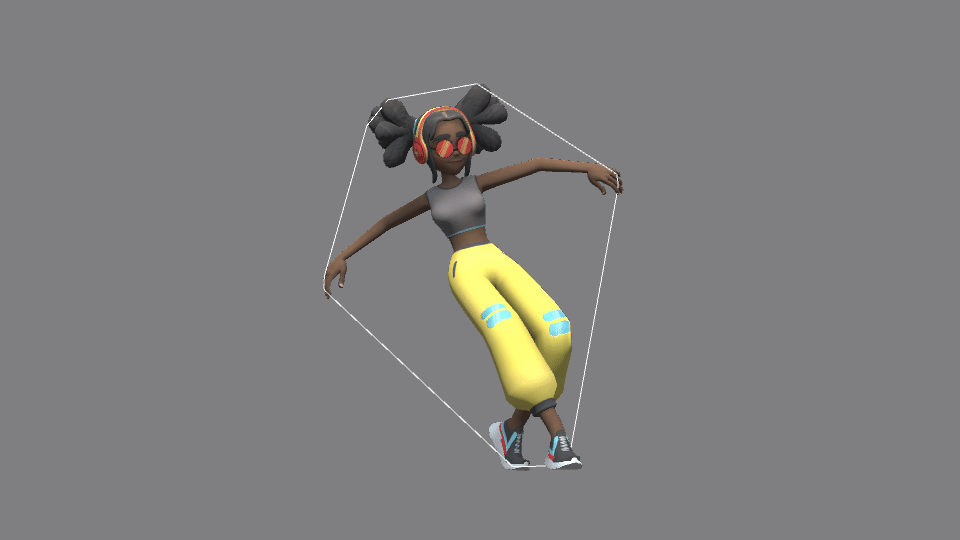

# unity-convexhull

Realtime fast convexhull generator for Unity.

Since this module generates a mesh, it is possible to use output mesh as a collider input for rigidBody collision.

### 2D Convexhull

### 3D Convexhull

## Usage
You can assign specific vertex on scene view to include convex calculation.

using a [simplex geom submodule](https://github.com/komietty/unity-simplex-geometry), so update submodule first.

## License
[MIT](LICENSE)
