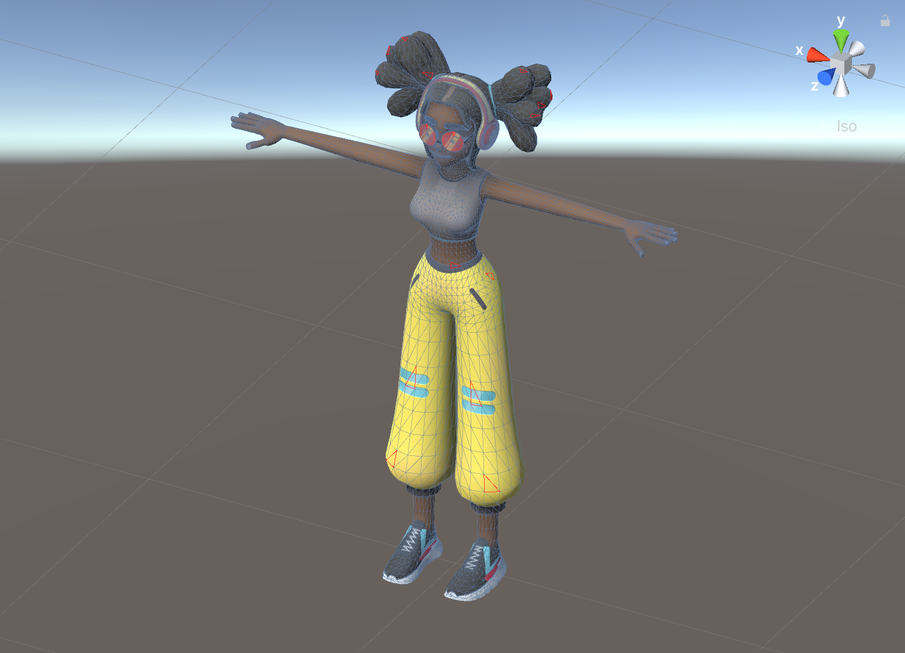

# unity-animated-quickhull

Realtime Fast convex generator for Unity.

## 2D Convexhull

## 3D Convexhull

## Usage
You can assign specific vertex on scene view to include convex calculation.

using a [simplex geom submodule](https://github.com/komietty/unity-simplex-geometry), so update submodule first.

## License
[MIT](LICENSE)
